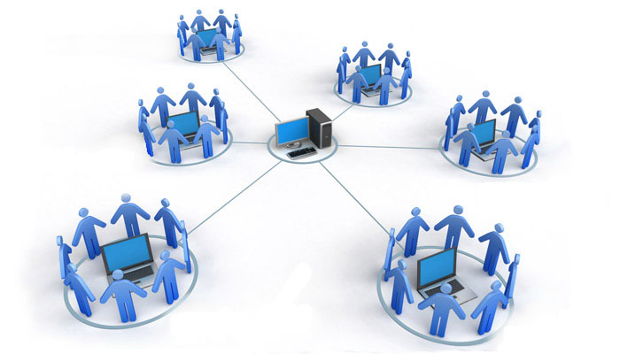
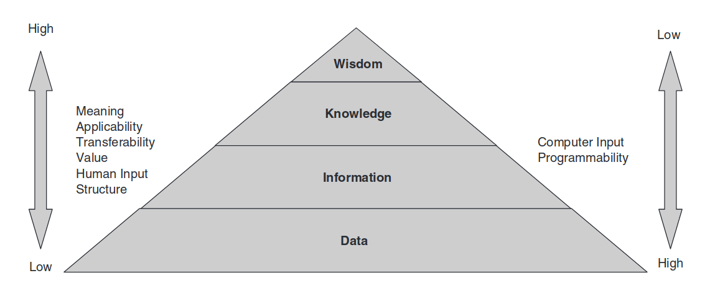
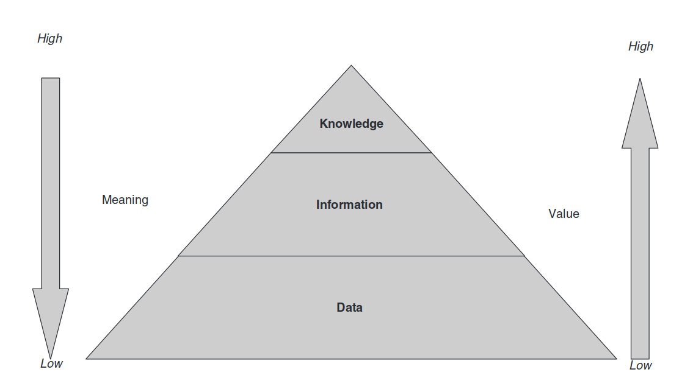
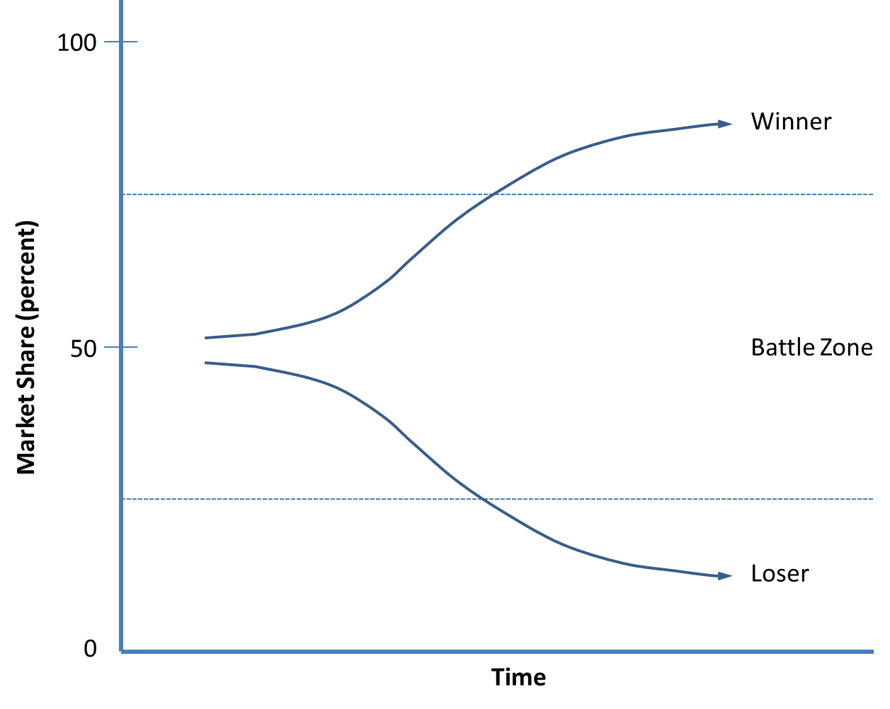
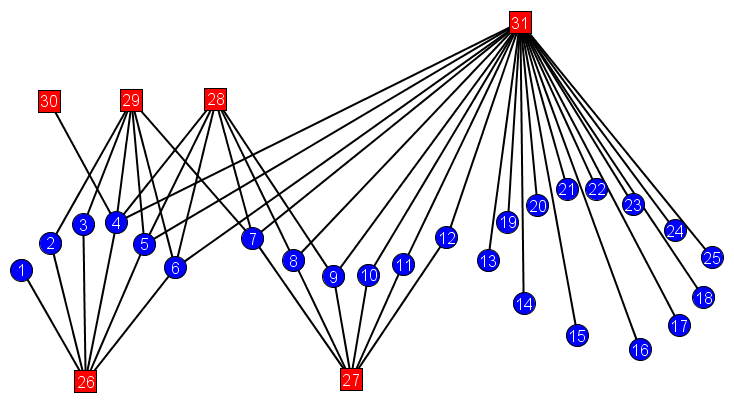
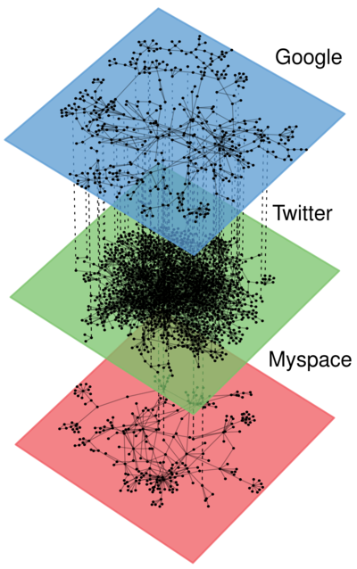
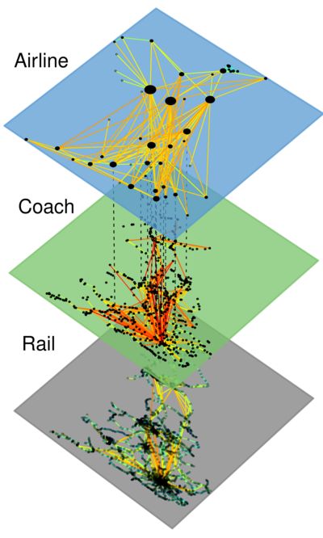

---
title: Digitalization & Organizations
subtitle: "Go Digital or Undergo Disruption"
author: Quentin Chenevier
theme: white
parallaxBackgroundImage: images/algorithms_white_blur.jpg
parallaxBackgroundSize: "2000px 1125px"
parallaxBackgroundHorizontal: 20
parallaxBackgroundVertical: 10
...

# About

## 2 dimensions

Direction: Stimulus &#8213; Response

Scale: Actor &#8213; Organization

## Stimulus &#8213; Response
Action &#8213; Reaction

Input &#8213; Output

## Stimulus
<h1>&#8594; &#9679; &#8592;</h1>
- What is changing?
- What is influencing your behavior?
- What is the new context for organizations?
- What are the risks and opportunities of this change?

## Response
<h1>&#8592; &#9679; &#8594;</h1>
- What can you do about the change?
- What kind of behavior should be favored?
- How can organizations adapt to the new context?
- How can you adapt to the new context?

## Actor &#8213; Organization
Micro &#8213; Macro

Unit &#8213; Group

## Actor

Humans & Machines

- What is happening locally?
- What is happening from the point of view of a single human?
- What are the technologies at hand?

## Organization

Network of actors bound by interactions & flows

- What is happening globally?
- What are the new systems of technologies?
- How are organized Digital Organizations?

# Stimulus at Actors' scale

## Information Properties

## Information hierarchy

Humans

Machines

## Information transformation

Data + Meaning = Information

Information + Decision = Value

## Information combination

Pattern detection = Knowledge = Algorithm

## Information Dynamics

## Machines exponential growth
- **machines & information** seem to be growing in **symbiose**.
- data, information and knowledge **flows** are **positive-Sum**
- information **technology** **exponential performance** and **ubiquity**
-  **data & information**  **exponential quantity** growth, also called big data.

## Machines generate Knowledge
abundance of information: **automated knowledge generation from data** = **machine learning**.
encroaching **human knowledge workers skills**.

## Humans' core contribution: Meaning & Value
**humans** providing **meaning & value**.
Humans are **information producers** with more **relationships & interactions**.

## Information Flows Constraints
Information & knowledge **transfer to humans** is constrained by **time & attention**. ==> **competition for attention**.

Knowledge **transfer to machines** is constrained by **design talent**. this transfer is **accelerating** thanks to **machine learning**.

Simultaneously, human **physical skills** are trivialized by **automation, Robotics, 3D printing** & additive manufacturing.

# Stimulus at Organizations' scale

## Organizations' environment properties

Porter's 5 Competitive Forces:

- substitution
- rivalry
- new entrants
- powerful buyers
- powerful suppliers

## Networks dynamics

## Networks growth fueling Information expansion
growth of technology performance & Usage + information expansion = **creation & expansion of networks** = new **market dynamics**.
networks are **accelerating** information speed and **pace of innovation**

## Networks positive feedback

network externalities are **positive feedbacks**. value propositions are increasingly based on information & networks.
positive feedbacks create **tippy markets**: the winner takes all.

## Disruption of long-lived oligopolies by temporal monopolies
Lower negative feedback in markets change their taxonomy: long-lived oligopolies are replaced by **temporal monopolies**. And such tippy markets & temporal monopolies are **increasing rate of disruption & market Change**.

## Two-sided networks

All markets are made of **two-sided networks** and can be addressed by **platforms**. Platforms are **pooling uncertainty**, which is a **cross-side positive externality**.

## Merging of networks

As networks connect to each other, they create new markets and **increase substitution & rivalry**.
not only telecommunications: all kinds of **virtual networks and platforms**.

## 5 forces

## Rivalry
networks winner-take-all dynamic is **increasing rivalry** among competitors to take on new emerging markets.

## Substitution
Platforms create **substitutes by "envelopment"**: they tend to expand their services to retain their user base and compete with other platforms having a similar user base. Platforms inherently create subsidized or **free products** that increase the power of substitution.

## Platforms weakens powerful players
Platforms exhibit same-side negative externality: **increased competition weakens powerful buyers & suppliers**.

## Platforms strengthen small players
Platforms & technological innovation increase threat of entry by **small players**.
Networks reshape existing markets by welcoming **new entrants**
Platforms strengthen small players and weak consumers & buyers by providing **access to market**.

## Era of networks & platforms
In the end, platforms seem to be **economically more efficient** than integrated companies.
era of platforms, which are bringing with them huge ecosystems of small players

# Response of Organizations

## Organizations' properties

Treacy's **value disciplines**: **product leadership**, **customer intimacy**, **operational excellence**.

digitalization is abolishing former constraints on strategy: digital players are now able to outperform you on all three value disciplines.

## Reassess your Organization's Assets & Build Strategic Information Management Capabilities

First step is to **assess** your organizational value in this information abundant environnment. Reevaluate your assets to find **information-based assets** that **complement** your existing assets. Identify activities to **create information value**, such as **building connections** to your **user base**. Then, Choose a way to **capture information value**. Finally, analyze your **business model**: what kind of **rights over your assets** do you sell?

The overarching goal is to aim for **zero marginal costs**. Mutate your business model towards a low marginal costs one **to outperform** others. Ultimately, you can exploit **financial pressure to trigger change** by divesting & reinvesting.

Operationally, you need to **upgrade the information processing** of your organization. Rebuild business around an **IT backbone of digital platforms**. **Centralize information management** & IT **to decentralize information exploitation** by employees. Integrate **data & algorithms** in a **centralized** digital platform. Gather enough **IT skills** to build your **technical capability**. Fight **technical debt** to keep **technical agility**. Finally, foster an **agile culture** to adapt to these changes.

## Improve the Organization across each of the 3 Value Disciplines

## Organize for product leadership

Organize to compete on **product leadership** by focusing on **speed & innovation**. Build assets for product leadership such as **digital platforms** & **access to infrastructure**. **Experiment** in real-world conditions with real-time data on a digital platform. **Disrupt yourself** rather than being disrupted by your competitors. **Regulation & IP** can't protect you from disruption, but may temporary **increase value** of information-based assets. **Scale up** & down quickly through **IT renting, staff on-demand** & partnerships. Establish **small & independent units** to increase focus & accelerate decision-making.

## Organize for customer intimacy

Organize to compete on **customer intimacy** by focusing on **adaptation & customization**. Build assets for customer intimacy such as **sales infrastructure, brand & customer knowledge**. Adopt **value-based pricing**. **Sell Experience** goods by letting the customer having a taste. Manage customer loyalty & lock-in with **switching costs**. Evolve your value proposition **from product to service to partnership**. Profit from you user base and complement your offer by getting into the search-broker business, i.e. by becoming a platform for your ecosystem.

## Organize for operational excellence

Organize to compete on **optimization & operational excellence** by focusing on **optimization & price-performance ratio**. Build assets for operational excellence such as **partnership network & algorithms**. **Automate tasks** with algorithms & **enhance employees** with interfaces. Gather **operational data** by measuring everything. Reduce fixed costs by **virtualizing business** and using **staff on-demand**. Complement your product by nurturing an ecosystem & **partnering** beyond supply chain management.

# Response of Actors

## Upgrade the Actors' Information Processing

As we have seen, value of information comes from decision-making: the goal of fostering those 8 key behaviours is to increase both the quantity and quality of the decisions taken in the organization.

## Upgrade Quality of Decisions
- **Listening**: Communication is now widespread and the ability to listen to is one of the most overlooked skills in modern organizations. 2-way communication now prevails over 1-way broadcast. Yet many people have poor listening skills.
- **Learning & Experimenting**: The ability to learn and experiment has been stiffled in many organizations in order to avoid unnecessary waste. As a result, failure of an experiment is often seen as a bad thing. Yet, it is now possible to design cheap experiments to learn. Most people don't feel safe enough in their organizations to propose such experiments.
- **Open mindedness**: Many organizations have emphasized the power of experts and risk management. However, this tends to naturally increase refusal of operations' changes and of new ideas. A quickly changing environment requires having people, while still having some expertise, which are accepting change & are able to make powerful cognitive associations.
- **Rationality**: Many people think we are behaving rationally, while our cognitive biases have tremendous effect on our decisions. This effect is even more pronounced for managers which tend to rely on their intuition. Overcoming these cognitive biases might necessitate trainings on data-based decision-making, which leads to better decisions. Rationality is strongly related to listening and open mindedness skills, in order to be able to listen to differing point of views when a complex decision is made.

## Upgrade Quantity of Decisions
- **Agility**: Due to increase pace of innovation, even the most detailed planning become obsolete quickly, as the environment moves quickly. Yet, in many organizations, once a decision has been made, it's written in stone. Whereas iterative strategy & real-time evaluation and reconfiguration should prevail over the false impression of control provided by a long-term planning.
- **Connectedness**: Since the introduction of email, many organizations are overwhelmed by "too much" information. Yet, it is not too much, it is only poorly managed. There is a strong need to increase usage of social networking technologies to accelerate information flows and to help sorting through the overflow more easily.
- **Autonomy**: It is the complementary behaviour of agility. To improve speed of decision-making, organizations now require people able to take complex decisions quickly, based on the information they have at hand. Workforces without a culture of autonomy are particularly vulnerable, as they are less and less valuable compared to the progressing automation technologies.
- **Engagement**: Environment is key to motivation. People share more and feel more engaged with their colleagues when they are in contact with other engaged people.

## Update the Leadership Style of the Leading Actors

Finally, Key leadership behaviours need to be revamped guiding instead of controlling:

- **Engaging & up-to-date leadership** is mandatory: Many managers lack the technical skills to understand the on-going technological revolution and the soft skills to properly accompany their staff through the transformation challenges which awaits them. Retraining them and hiring new staff to bring some fresh air is today an imperative.
- **Envisioning** instead of planning: As said earlier, every planning now becomes obsolete more quickly. However a long-term vision is still necessary to ensure that everyday decisions are contributing to the same long-term goal. This long-term vision requires special skills and personalities to build it.
- **Unlocking investment** decision: Many transformation efforts fail because investment is poorly managed or even not available. Leaders should unlock slack resources to get new projects going.
- **Letting structure emerge** from value & experiment: By encouraging learning & autonomy behaviours among their employees, Leaders have the opportunity of gaining time and sparing transformation efforts by letting them decide what is the optimal structure to operate. This implies having the ability to challenge benevolently the status quo if a sub-optimal structure is chosen.
