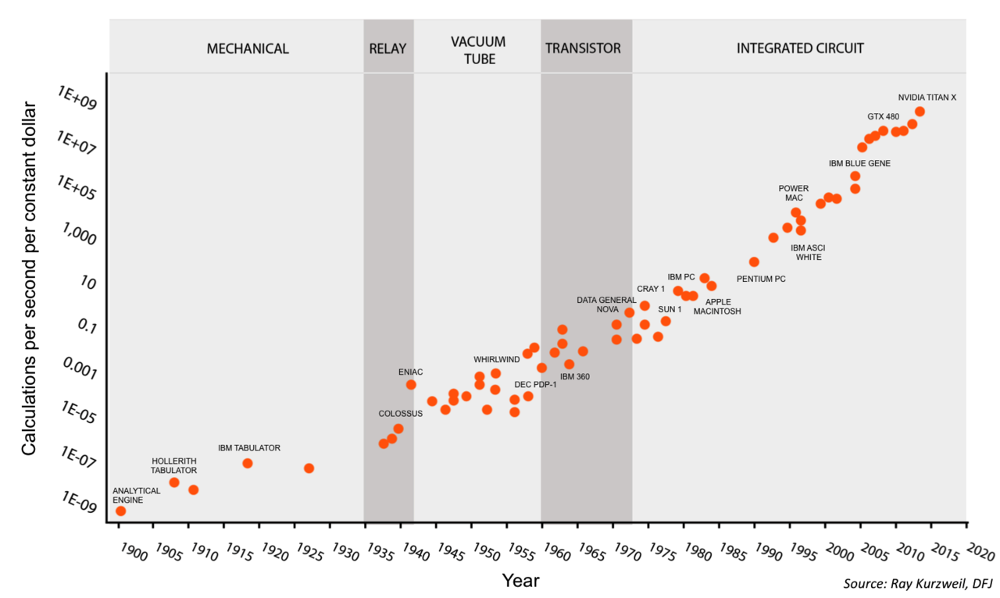

---
title: Digitalization & Organizations
subtitle: "Go Digital or Undergo Disruption"
author: Quentin Chenevier
theme: white
parallaxBackgroundImage: presentation_background.jpg
parallaxBackgroundSize: "1900px 1255px"
parallaxBackgroundHorizontal: 20
parallaxBackgroundVertical: 10
...

# Introduction

## Industrial Revolution

- *1829* &#8594; Coal
- *1875* &#8594; Steel
- *1908* &#8594; Oil
- *1971* &#8594; Microprocessor

## Transition & Dislocation

**Economic dislocation**   
Rapid growth &#8213; Increasing poverty

## 2 dimensions

**Direction**: Stimulus &#8213; Response

**Scale**: Actor &#8213; Organization

## Stimulus &#8213; Response
Action &#8213; Reaction

Input &#8213; Output

## Stimulus
<h1>&#8594; &#9679; &#8592;</h1>
- What is changing?
- What is influencing your behavior?
- What is the new context for organizations?
- What are the risks and opportunities of this change?

## Response
<h1>&#8592; &#9679; &#8594;</h1>
- What can you do about the change?
- What kind of behavior should be favored?
- How can organizations adapt to the new context?
- How can you adapt to the new context?

## Actor &#8213; Organization
Micro &#8213; Macro

Unit &#8213; Group

## Actor

**Humans & Machines**

- What is happening locally?
- What is happening from the point of view of a single human?
- What are the technologies at hand?

## Organization

**Network of actors** bound by interactions & flows

- What is happening globally?
- What are the new systems of technologies?
- How are organized Digital Organizations?

# Stimulus at Actors' scale

## Information Properties

## Information hierarchy

**Humans**

**Machines**

## Information transformation

Data + **Meaning** = Information

Information + **Decision** = Value

## Information combination

Information Pattern = Knowledge = Algorithm

## Information Dynamics

## Exponential growth

**Symbiose** between machines & informations:

- Exponential technology performance
- Exponential information quantity

## Knowledge generation

**Machine learning** = knowledge generation from data

Now encroaching human knowledge workers skills.

## Humans' essence: Meaning & Value
Humans are the sole provider of **meaning & value**.

Humans are **information producers** with more relationships & interactions than ever.

## Flows Constraints
Transfer to **humans** is constrained by **time & attention**.

Transfer to **machines** is constrained by **design talent**, but accelerating with machine learning.

# Stimulus at Organizations' scale

## Organizations' environment properties

Porter's **5 competitive forces**

## Networks dynamics

## Networks' symbiose with Information expansion
Growth of technology performance, usage & information expansion:

- **creation & expansion of networks**
- new **market dynamics**.

Networks are **accelerating** information speed and **pace of innovation**.

## Networks' positive feedback

Networks &#8594; **positive feedbacks** &#8594; **tippy markets**

Value propositions are increasingly information-based.

## Temporal monopolies
Information-based markets have a different **taxonomy** because of lower negative feedback.

**Long-lived oligopolies** are replaced by **temporal monopolies**.

## Two-sided networks

All markets are made of **two-sided networks** and can be addressed by **platforms**.

Platforms are **pooling uncertainty**, which is a **cross-side positive externality**.

## Merging of networks

As networks connect to each other, they create new markets and **increase substitution & rivalry**.

Not only telecommunications: all kinds of **virtual networks and platforms**.

## 5 forces changes

## Rivalry
Networks winner-take-all dynamic is **increasing rivalry** among competitors to take on new emerging markets.

## Substitution
Platforms create **substitutes by "envelopment"**: they tend to expand their services to retain their user base and compete with other platforms having a similar user base.

Platforms inherently create subsidized or **free products** that increase the power of substitution.

## Weakening powerful players
Platforms exhibit same-side negative externality: **increased competition weakens powerful buyers & suppliers**.

## Strengthening small players
Platforms & technological innovation increase threat of entry by **small players**.

Networks reshape existing markets by welcoming **new entrants** and providing **access to market**.

## Era of networks & platforms
Platforms seem to be **economically more efficient** than integrated companies.

We enter the **Era of Platforms**, which are bringing with them huge ecosystems of small players.

# Response of Organizations

## Organizations' properties

**Unconstrained strategy**: Digital players are able to outperform you on all three value disciplines.

## Reassess your Assets

Reevaluate your assets to find **information-based assets** that **complement** your existing assets.

Identify activities to **create information value**, such as **building connections** to your **user base**.

Then, choose a way to **capture information value**.

## Transform your Business model

Analyze your **business model**: what kind of **rights over your assets** do you sell?

The overarching goal is to aim for **zero marginal costs**. Mutate your business model towards a low marginal costs one **to outperform** others.

Ultimately, you can exploit **financial pressure to trigger change** by divesting & reinvesting.

## Build your Backbone

Operationally, you need to **upgrade the information processing** of your organization, around an **IT backbone** of digital platforms.

**Centralize** information management to **decentralize** information exploitation by employees.

Integrate **data & algorithms** in a centralized digital platform.

## Cultivate your capabilities

Gather enough **IT skills** to build your **technical capability**.

Fight **technical debt** to keep **technical agility**.

Finally, foster an **agile culture** to adapt to these changes.

## Improve across each of the 3 Value Disciplines

## Product leadership

Focusing on **speed & innovation** by building digital platforms & access to infrastructure.

- **Experiment** in real-world conditions with real-time data.
- **Scale up** & down quickly through **IT renting & staff on-demand** & partnerships.
- Establish **small & independent units** to increase focus & accelerate decision-making.
- **Disrupt yourself**.

## Customer intimacy

Focusing on **adaptation & customization** by building **sales infrastructure, brand & customer knowledge**.

- Adopt **value-based pricing**.
- **Sell Experience** goods by letting the customer having a taste.
- Evolve your value proposition **from product to service to partnership**.
- Manage customer loyalty with **switching costs**.

## Operational excellence

Focusing on **optimization & price-performance ratio** by building **partnership networks & algorithms**.

- Gather **operational data** by measuring everything.
- **Automate tasks** with algorithms & **enhance employees** with interfaces.
- Reduce fixed costs by **virtualizing business** and using **staff on-demand**.
- Complement your product by nurturing an ecosystem & **partnering** beyond supply chain management.

# Response of Actors

## Upgrade the Actors' Information Processing

As we have seen, value of information comes from decision-making: the goal of fostering those 8 key behaviours is to **increase both the quantity and quality of the decisions** taken in the organization.

## Upgrade Quality of Decisions

## Listening

Communication is now widespread and the ability to listen is **one of the most overlooked skills** in modern organizations.

2-way communication now prevails over 1-way broadcast. Yet many people have poor listening skills.

## Learning & Experimenting

The ability to learn and **experiment has been stiffled** in many organizations in order to avoid unnecessary waste.

As a result, failure of an experiment is often seen as a bad thing. Yet, it is now possible to design cheap experiments to learn. Most people don't feel safe enough in their organizations to propose such experiments.

## Open mindedness

Many organizations have emphasized the **power of experts and risk management**. However, this tends to naturally increase refusal of operations' changes and of new ideas.

A quickly changing environment requires having people, while still having some expertise, which are accepting change & are able to make powerful cognitive associations.

## Rationality

**Cognitive biases** have tremendous effect on our decisions and are even more pronounced for managers which tend to rely on their intuition.

Overcoming these cognitive biases might necessitate **trainings on data-based decision-making**.

Rationality is **strongly related to listening and open mindedness** skills: understanding differing point of views when a complex decision is made.

## Upgrade Quantity of Decisions

## Agility

Even the most detailed **planning becomes obsolete quickly**, as the environment moves quickly. Yet, in many organizations, once a decision has been made, it's written in stone.

Whereas **iterative strategy & real-time evaluation and reconfiguration** should prevail over the false impression of control provided by a long-term planning.

## Connectedness

Since the introduction of email, many organizations are overwhelmed by **information overflow**. Yet, it is not too much, it is **only poorly managed** information.

There is a strong need to increase usage of **social networking** technologies to **accelerate flows** and to **help sorting** through the overflow more easily.

## Autonomy

Complementary behaviour of agility. To improve speed of decision-making, organizations now require **people able to take complex decisions** quickly, based on the information they have at hand.

Workforces without a culture of autonomy are particularly vulnerable, as they are less and less valuable compared to the progressing automation technologies.

## Engagement

Environment is key to motivation. People share more and feel more engaged with their colleagues when they are in contact with other engaged people.

## Update the Leadership Style of the Leading Actors

Finally, Key leadership behaviours need to be revamped to promote **guiding instead of controlling**.

## Engaging & up-to-date leadership

Many managers lack the **technical skills** to understand the on-going technological revolution and the **soft skills** to properly accompany their staff through the transformation challenges which awaits them.

Retraining them and hiring new staff to bring some fresh air is today an imperative.

## Envisioning

Every planning now becomes obsolete more quickly. However a **long-term vision is still necessary** to ensure that everyday decisions are contributing to the same long-term goal.

This long-term vision requires special skills and personalities to build it.

## Unlocking investment

Many transformation efforts fail because investment is poorly managed or even not available.

Leaders should **unlock slack resources** to get new projects going.

## Letting structure emerge

By encouraging learning & autonomy behaviours among their employees, Leaders have the opportunity of gaining time and sparing transformation efforts by **letting employees decide what is the optimal structure** to operate.

This implies having the ability to challenge benevolently the status quo if a sub-optimal structure is chosen.

# Conclusion

## Stimulus

Increase of information in speed, quantity, complexity and value, since several decades.

Creation and intensification networks which are changing the dynamics of organizations and their environment.

## Response of Organizations

Change their structure by **becoming networks** themselves, built on a strong **information management backbone**.

Reassess their assets to find those relevant to the new environment.

Have the opportunity to **improve in all three value disciplines**.  

## Response of Actors

Change of mindset to become **better at information transmitting, processing and decision-making**.

Increase the **quality and the quantity of the decisions**.

Leadership focused on **encouraging learning & information flowing** and more focused on **coaching & envisioning**.

## Where are we ?

Digital organizations have already discovered all those principles.

Information revolution hasn't reached its apogee: additive manufacturing, internet of things, blockchain, CRISPR-CAS9 genetic engineering, transport automation...

**This technological revolution might be stronger** and longer than the other technological revolutions.

## Humanity is levelling up

And it might be gaining several levels at once.   

## Thank you

:)
